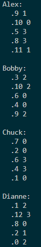
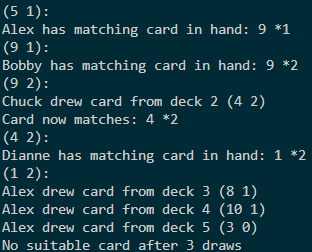
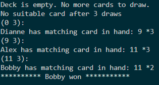

# Crazy 8 Card Game Project
A Java implementation of the classic Crazy 8 card game!

## Instructions:
Play with multiple players, draw and match cards by rank or suit, and try to be the first to empty your hand!


---

## Features

- Add multiple players with customizable names
- Automatic deck initialization and shuffling  
- Players can play matching cards or draw from the deck  
- Simple console-based interface  
- Game detects the winner when a player empties their hand  

---

## How to Run

1. Clone the repository:
```bash
git clone https://github.com/naomigracem/Crazy8Project.git
```

## Gameplay Screenshots:
<!-- Game start -->
<div align="center">
  <em>Game start: players’ hands are dealt and displayed.</em>
  <br/><br/>
  
</div>

<br/>

<!-- Gameplay -->
<div align="center">
  <em>General gameplay.</em>
  <br/><br/>
  
</div>

<br/>

<!-- Winner -->
<div align="center">
  <em>Game end: winner is announced when a player empties their hand.</em>
  <br/><br/>
  
</div>


